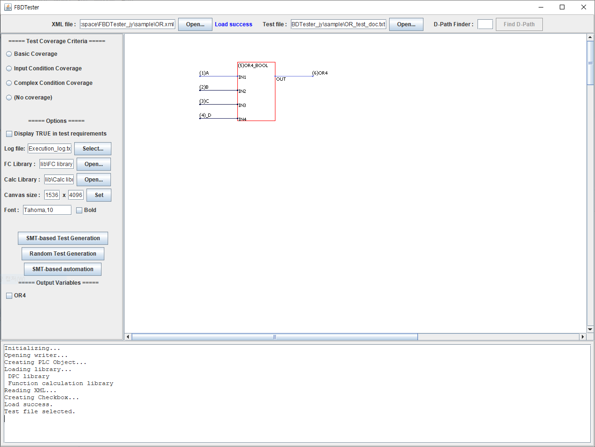

# What is FBDTester 2.0?
As Function Block Diagram (FBD) programs are used to implement safety-critical systems such as nuclear reactor protection systems, it is crucial to generate effective test cases.
FBD programs are running on programmable logic controllers (PLCs) that execute the programs repeatedly within a particular scan time.
Among the elements of FBD programs, function blocks and feedback variables save the inputs or outputs of the previous scan cycle into internal memories. 
The data stored in the internal memory are used to operate the function blocks of the next scan cycle. 
Researchers have recently developed an automated test generation technique aiming to satisfy several structural test coverage criteria for FBD programs. 
Among them, Jee et al.'s approach has an advantage of generating tests from FBD programs without requiring any intermediate models. However, test sequence generation for FBD programs with internal memory states was not fully automated in Jee et al's approach. 
This project **FBDTester_v2.0** extends Jee et al.'s work by generating test sequences from FBD programs with internal memory states in a fully automated manner.

# Installation & Usage
* Installation
 * This project was developed using Eclipse IDE, and build and installation also use Eclipse.
  1. Copy the web URL
  2. Clone a Git repository in Eclipse with the copied web URL
  3. Run the project FBDTesting - FBDTester class not MainWindow - kr.ac.kaist.pSET2XML_Translation
* Usage
 
  1. Open an example XML file
  2. Open an example test file
  3. Select test Coverage Criteria among BC, ICC, CCC
  4. Click SMT-based Test Generation
 ** The detailed meaning of test file, BC, ICC, and CCC is explained in the below publications.
 ** Random Test Generaation and SMT-based automation buttons are for the experimentation of the below publications.
# Publications
* International
  * Song, Jiyoung, Eunkyoung Jee, and Doo-Hwan Bae. "FBDTester 2.0: Automated test sequence generation for FBD programs with internal memory states." Science of Computer Programming 163 (2018): 115-137.
  * Song, Jiyoung, Eunkyoung Jee, and Doo-Hwan Bae. "Automated test sequence generation for function block diagram programs." 2016 23rd Asia-Pacific Software Engineering Conference (APSEC). IEEE, 2016.
* Domestic (in Korean)
  * 지은경, 송지영, and 배두환. "FBD 프로그램에 대한 뮤테이션 연산자 확장 정의 및 적용." 정보과학회 컴퓨팅의 실제 논문지 24.11 (2018): 589-595.
  * 송지영, 지은경, and 배두환. "FBD 프로그램 대상 구조적 커버리지를 만족시키는 테스트 시퀀스 생성 알고리즘." 한국정보과학회 학술발표논문집 (2015): 570-572.
# Developer Contact
* Jiyoung Song: jysong@se.kaist.ac.kr
